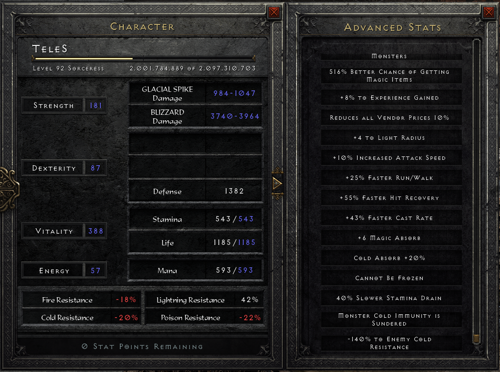

# D2R_Pindle
## 说明
就是瞎玩儿，分享给群里的朋友们\
搞了个d2r 刷hell难度pindle的bot，与其说是bot，不如说是脚本，因为没有AI :)
这个bot很简单
* 进入红门，tele到pindle的temple，甩几个冰尖柱和暴风雪，来个2~3轮， 不管有没打死然后就开始查drop，然后退出再来周而复始
* 目前只检查amu，ring，rune，diadem，shako，gc，sc，flawless和perfect gem
* 有时候由于pindle死的晚了点，由于bot甩完技能已经开始查drop了，可能会有遗漏
* 而且由于只查如上所述的物品，其他的物品bot不会识别，如果你看到了，手快点，在bot退出游戏之前捡起来，或者在bot运行的命令行ctrl+c终止bot

## Prerequisite
1. 安装 Python 3.10
2. checkout this repo 
3. 创建 Python venv （optional） 
4. 打开命令行，在repo的目录下运行 “pip install requirements.txt” 安装bot需要的libraries， 
5. 完成以上后不要关掉命令行窗口，之后用来运行bot

## 重点
* 只能是暴风雪纯冰法 （而且拥有tele技能）
* 需要act5佣兵，需要**执法者**能站得住而且能保护你不让hell的pindle冲上来贴脸
* 目前只支持游戏是**英文**而且**无mod** ！！！！！！
* 这是我的冰法的details，运行bot没有问题， 需要25~30左右高跑，35以上的fcr，也要一定的伤害哈

* 设置游戏：小地图进入游戏后是默认开着的而且 “**必须在右边**” ！！！
* 设置游戏：hp和mp的数值“**必须默认显示**” ！！！
* 打开游戏确定你的法师角色是第一位，而且进入hell难度是在**act5**
* 完成拯救anya的任务（不然没红门没法打pindle）

## 使用说明
* 打开main.py，手动输入冰法的满血和满蓝数值，满血在line10，满蓝在line11
* 设置冰装甲，冰尖柱，暴风雪和传送快捷键 line 13 - line 16
* 完成以上所有以后把游戏停留在menu界面如下（确定是角色list第一角色）

* Prerequisite 最后的命令行里运行 “python main.py” 开启bot (**命令行不要遮住上图的play button！！！**)
* 无论何时，在menu界面开启bot
* 调试时，可以用nm难度，一般不会死，把main.py的line 18改成False
